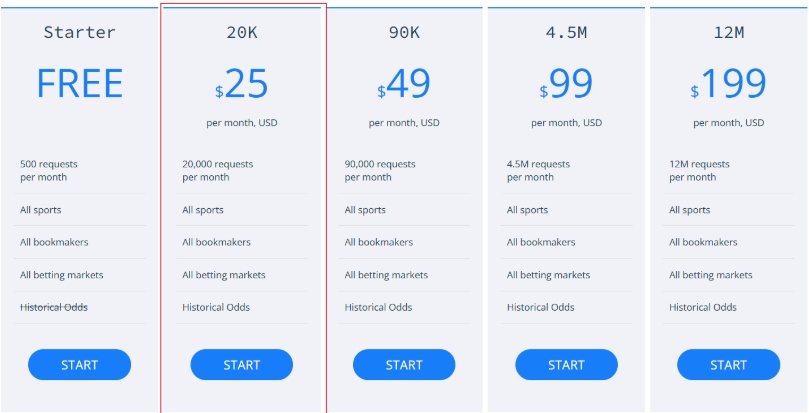

[](https://classroom.github.com/a/_SwzfpU1)

# What is the best betting strategy for betting on premier league games?

Authors: Matthew Thoomkuzhy, Leo Liao and Noah Salehi 
---


---
## Project Overview 🗂

**We want to figure out what the best betting strategy is for premier league games.**


This project investigates the **profitability and sustainability** of betting strategies in the **English Premier League (EPL)** by backtesting historical match data. Our backtesting simulates the hypothetical growth of a **£1000 bankroll** across all matches in our dataset.  


## Research Areas  

We explore three main areas in our project:  

### 1. Simple Directional Strategies  
These involve placing bets based on an expected match outcome. To uncover potential **alpha**, we analyze **odds mispricing** in both home and away teams to inform our **discretionary strategies**.  

We backtest **six directional strategies** in total:  
- **Three simple strategies:** Betting on the **favorite, underdog, or draw**.  
- **Three discretionary strategies:** Betting on **home favorites, home underdogs, and away underdogs**.  

### 2. Arbitrage Strategies  
These strategies exploit **pricing inefficiencies** across bookmakers to guarantee **risk-free returns**. We investigate whether certain games have **higher win probabilities**, allowing for potential **biased arbitrage opportunities**.  

We backtest **four arbitrage strategies**:  
- **One unbiased arbitrage strategy**  
- **Three biased arbitrage strategies:** Favoring the **favorite, second-favorite, or underdog**.  

### 3. Exploratory Data Analysis (EDA)  
In preparation for backtesting, we conducted **extensive EDA** on betting trends in EPL matches, including:  
- **Bookmakers offering the best odds**  
- **Prevalence of arbitrage opportunities**  
- **Win rates of various strategies**  

These findings can be accessed in:  
- 📂 **`/data/visualisations`**  
- 📓 **`NB03-Simple_Betting_Strategies.ipynb`**  
- 📓 **`NB04-arbitrage_betting_strategies.ipynb`**  

---
**In order to do this, we need to collect 2 pieces of data:** 

1. Historical odds data for premier league games for the past 5 seasons, we will be collecting this using ['the odds API'](https://the-odds-api.com/)
2. Fixture outcomes for all premier league games for the past 5 seasons, can be found at  ['Premier League Matches'](https://www.football-data.co.uk/englandm.php)

---

### Repository Structure
```bash
.
├─ README.md
├─ .gitignore
├─ code
│  ├─ NB-01: Data Collection.ipynb
│  ├─ NB-02: Data Processing.ipynb
│  ├─ NB-03: Visualisation of Simple Betting Strategies.ipynb
│  ├─ NB-04: Visualisation of Arbitrage Betting Strategies.ipynb
│  ├─ auth.py
│  └─ functions.py
└─ data
   ├─ sports_odds.db
   ├─ raw
   │  ├─ historical_odds_data.json
   │  └─ historical_match_data.csv
   └─ visualisations
      ├─ arb_betting_strategies
      └─ simple_betting_strategies
```

## 🛠️ How to Recreate This Project

### 1. Clone the Repository  
Clone this repository to your local machine:  
```bash
git clone git@github.com:lse-ds105/ds105a-2024-project-good_gamblers.git
cd ds105a-2024-project-good_gamblers

```
### 2. Set Up the Python Environment  
Use **conda** or **pyenv** to create and activate the environment.

#### With Conda:  
```bash
conda create -n good-gamblers python=3.9 -y
conda activate good-gamblers
pip install -r requirements.txt
```

#### With Pyenv + Virtualenv:
``` bash
python -m venv .venv
.venv\Scripts\activate # If on Windows
source .venv/bin/activate # If on macOS/Linux
pip install -r requirements.txt
```

### 3. API Plan



Reasons Why We Like Odds API:
1. Access to Real-Time and Historical Odds
2. Offers Odds from Various Bookmakers to Better Investigate Arbitrage Opportunities
3. Data Reliability and Authenticity

---

### 4. Run the Code  

#### Notebook 1: Data Collection  
Navigate to the `code/` directory and open `NB01 - Data Collection.ipynb`.  
This notebook collects raw data from the Historical Odds API and saves it in the `data/raw/` folder.  

#### Notebook 2: Data Processing  
Run `NB02 - Data Processing.ipynb` to process the raw data and merge it into an SQL database along with historical outcome data.  

#### Notebook 3: Simple Betting Strategies  
Execute `NB03 - Simple Betting Strategies.ipynb` to explore various basic betting strategies and backtest their performance.  

#### Notebook 4: Arbitrage Betting Strategies  
Run `NB04 - Arbitrage Betting Strategies.ipynb` to investigate both biased and unbiased arbitrage betting strategies and backtest them.  

## Acknowledgements  
- **Data Source**: [The Odds API](https://the-odds-api.com/) for providing comprehensive sports betting data.  
- **Libraries Used**: `requests`, `json`, `pandas`, `os`, `SQLAlchemy`, `datetime`, `python-dotenv`, `lets-plot`, `IPython`, `matplotlib`, `seaborn`, `numpy` for data processing, analysis, and visualization.  

---

## Contact  
For questions or feedback, please reach out via GitHub Issues or contribute to this project through pull requests.

