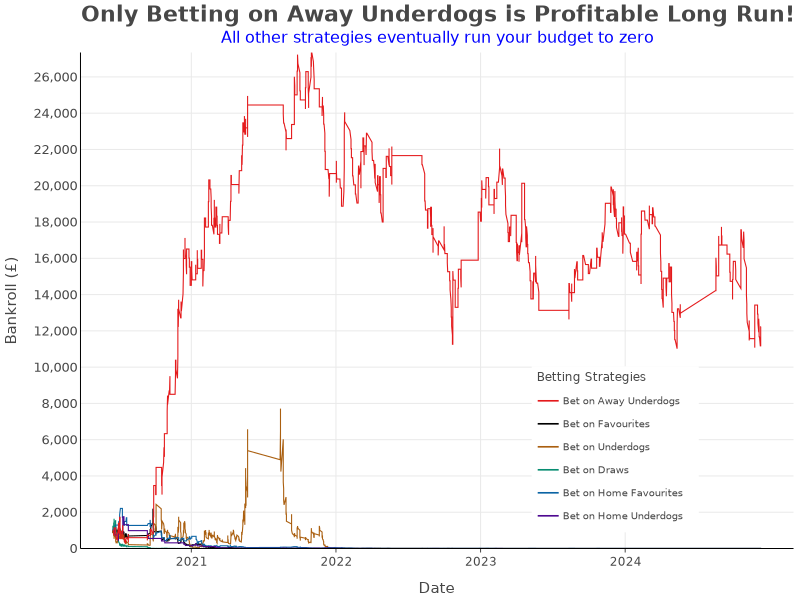
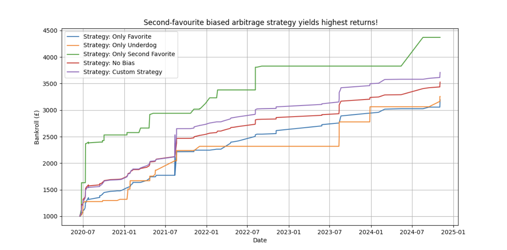

<link rel="stylesheet" type="text/css" href="./assets/css/style.css">

    <a href="index.html">Home</a>
    <a href="about.html">About</a>
    <a href="eda.html">Exploratory Data Analysis</a>
    <a href="backtesting.html">Backtesting</a>

# Backtesting Simple Betting Strategies

These were the strategies investigated, informed by the outcomes of our [Exploratory Data Analysis](eda.md)

<table>
    <thead>
        <tr>
            <th>Strategy</th>
            <th>Odds Range</th>
            <th>Strategy Type</th>
        </tr>
    </thead>
    <tbody>
        <tr>
            <td>Betting on Home Favourites</td>
            <td>1.25 to 1.75</td>
            <td>Discretionary</td>
        </tr>
        <tr>
            <td>Betting on Home Underdogs</td>
            <td>4.5 to 5.5</td>
            <td>Discretionary</td>
        </tr>
        <tr>
            <td>Betting on Away Underdogs</td>
            <td>2.5 to 4.0</td>
            <td>Discretionary</td>
        </tr>
        <tr>
            <td>Betting on Favourites</td>
            <td>NIL</td>
            <td>Simple</td>
        </tr>
        <tr>
            <td>Betting on Underdogs</td>
            <td>NIL</td>
            <td>Simple</td>
        </tr>
        <tr>
            <td>Betting on Draws</td>
            <td>NIL</td>
            <td>Simple</td>
        </tr>
    </tbody>
</table>

## **Performance Breakdown by Strategy**

<table>
    <tr>
        <th>Strategy</th>
        <th>Final Bankroll (£)</th>
        <th>Growth (%)</th>
        <th>Risk Level</th>
    </tr>
    <tr>
        <td><b>Bet on Away Underdogs</b></td>
        <td><b>£12,000</b></td>
        <td><b>+500%</b></td>
        <td>High</td>
    </tr>
    <tr>
        <td>Bet on Underdogs</td>
        <td>£0</td>
        <td>-100%</td>
        <td>Very High</td>
    </tr>
    <tr>
        <td>Bet on Favourites</td>
        <td>£0</td>
        <td>-100%</td>
        <td>Moderate</td>
    </tr>
    <tr>
        <td>Bet on Draws</td>
        <td>£0</td>
        <td>-100%</td>
        <td>Moderate</td>
    </tr>
    <tr>
        <td>Bet on Home Favourites</td>
        <td>£0</td>
        <td>-100%</td>
        <td>Low</td>
    </tr>
    <tr>
        <td>Bet on Home Underdogs</td>
        <td>£0</td>
        <td>-100%</td>
        <td>Very High</td>
    </tr>
</table>

## Insight

Our findings confirm that most strategies will lead to losing all of the bankroll over the 4.5 year period. The **only**  successful strategy involved betting on away underdogs, which had consistently underpriced odds as determined by our EDA. 

It is worth noting that most strategies ended up at zero until a **hard cap** was set for the stake limit, such that once proportional stakes exceeded this limit the stake wouldn't increase. Therefore dynamic staking, in most cases, was too aggressive and would lead to losing money.

**Custom strategy** : the custom strategy used xor logic to set conditions for a weak favourite or a strong underdog. The threshold for weak favourite was set at and implied win rate lower than 60%. The threshold for strong underdog was set at and implied win rate higher than 20%. Even after making abstract conditions based off of insights from the EDA about when outcomes are mispriced, the custom strategy still failed to outperform the best stratefy (biased second favourite abritrage).

To **maximize profitability**, further refinements should include:
- Data-driven stake sizing models to enhance compounding and more effectively mitigate risk
- Expansion of odds data collection to international leagues for even better earnings

# Backtesting Arbitrage Strategies:

## Overview

The following section shows the results of simulating different arbitrage strategies. The five strategies simulated were:
- Unbiased Arbitrage Betting
- Biased Arbitrage Betting Towards the Favourite Outcome (Lowest Odds)
- Biased Arbitrage Betting Towards the Second-Favourite Outcome (Second-Lowest Odds)
- Biased Arbitrage Betting Towards the Underdog (Highest Odds)
- Custom Arbitrage Strategy for Bias Towards Weak Favourites and Strong Underdogs

## Performance Breakdown by Strategy
<table>
    <tr>
        <th>Strategy</th>
        <th>Final Bankroll (£)</th>
        <th>Growth (%)</th>
        <th>Trade Frequency</th>
        <th>Return Per Event</th>
    </tr>
    <tr>
        <td><b>Only Second Favorite</b></td>
        <td><b>£4,500</b></td>
        <td><b>+350%</b></td>
        <td>Low</td>
        <td>High</td>
    </tr>
    <tr>
        <td>Custom Strategy</td>
        <td>£3,700</td>
        <td>+270%</td>
        <td>Moderate</td>
        <td>Moderate</td>
    </tr>
    <tr>
        <td>No Bias Strategy</td>
        <td>£3,500</td>
        <td>+250%</td>
        <td>High</td>
        <td>Low</td>
    </tr>
    <tr>
        <td>Only Favorite</td>
        <td>£3,000</td>
        <td>+200%</td>
        <td>Moderate</td>
        <td>Moderate</td>
    </tr>
    <tr>
        <td>Only Underdog</td>
        <td>£2,700</td>
        <td>+170%</td>
        <td>Lowest</td>
        <td>Highest</td>
    </tr>
</table>

## Insight

Our findings confirm that arbitrage betting remains a viable strategy in Premier League markets when focused on **second-favorite inefficiencies**. The most successful approach balances **high per-event profitability with sustainable trade frequency**, positioning the **"Only Second Favorite" strategy as the most effective long-term model**. This strategy has both a high enough profit per event and frequency of success to be compoundingly successful.

To **maximize profitability**, further refinements should include:
- Algorithmic bet execution to minimize delays
- Data-driven stake sizing models to enhance compounding
- Expansion of arbitrage detection to international leagues for cross-market inefficiencies

# Conclusion

Ultimately results show that simply gambling is almost never a good idea. The only instance of success when simply gambling was when betting on away underdogs, which appeared underpriced. Even when this was profitable, it was only profitable after implementing a hard flat cap on the stake limit. Therefore we would **strongly** advise against non-arbitrage betting. As this requires both luck from the uncertainty of the event and knowledge of how to set an optimal dynamic stake limit, which itself is uncertain.

Arbitrage, on the other hand is much more profitable. Although returns have slowed down in recent years, arbitrage opportunities should still be frequent when accounting for different leagues and sports. For premier league games, second-favourite biased arbitrage proved to be the most profitable, returning **350% in 4.5 years**. This is impressive considering the S&P500 returned 82% in the same period. This strategy had the optimal blend of profit per event and frequency of payout. In the future, we aim to deploy advanced statistical techniques to dynamically determine the ratio of bias between the events. This will help us determine the optimal bias between outcomes for each event.
