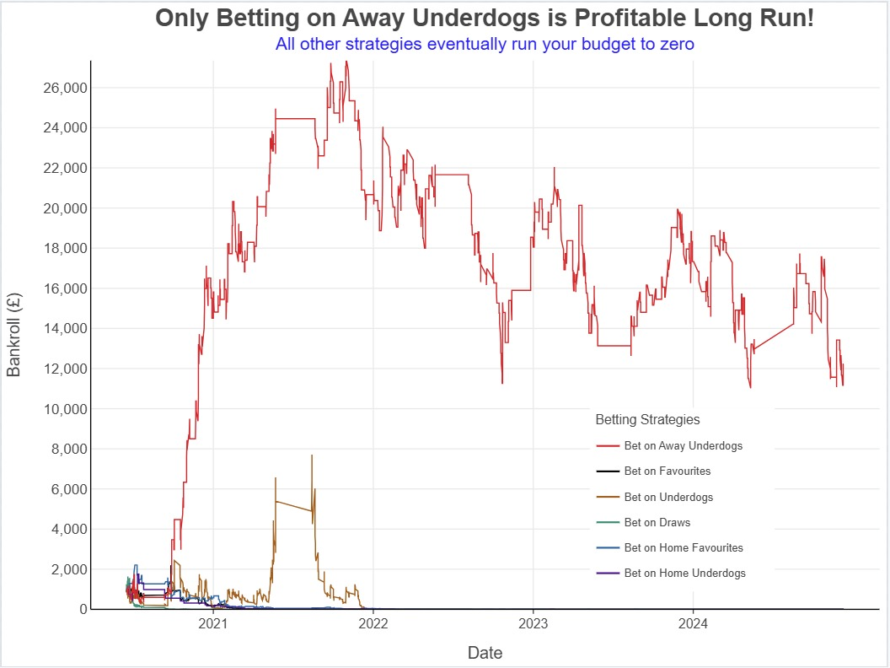

<link rel="stylesheet" type="text/css" href="./assets/css/style.css">

    <a href="index.html">Home</a>
    <a href="about.html">About</a>
    <a href="eda.html">Exploratory Data Analysis</a>
    <a href="backtesting.html">Backtesting</a>

# Backtesting Results

In this section, we developed backtesting functions to simulate betting strategies on the 5-year sample. We categorized these into simple strategies explored in NB03 and arbitrage strategies explored in NB04.

### **Simulation of simple betting strategies**:

#### **Overview:**

The following section shows the results of simulating simple betting strategies. The six strategies simulated were:
- Betting on favourites
- Betting on underdogs
- Betting on draws
- Betting on home favourites
- Betting on home underdogs
- Betting on away underdogs

## **Performance Breakdown by Strategy**

<table>
    <tr>
        <th>Strategy</th>
        <th>Final Bankroll (£)</th>
        <th>Growth (%)</th>
        <th>Risk Level</th>
    </tr>
    <tr>
        <td><b>Bet on Away Underdogs</b></td>
        <td><b>£12,000</b></td>
        <td><b>+500%</b></td>
        <td>High</td>
    </tr>
    <tr>
        <td>Bet on Underdogs</td>
        <td>£0</td>
        <td>-100%</td>
        <td>Very High</td>
    </tr>
    <tr>
        <td>Bet on Favourites</td>
        <td>£0</td>
        <td>-100%</td>
        <td>Moderate</td>
    </tr>
    <tr>
        <td>Bet on Draws</td>
        <td>£0</td>
        <td>-100%</td>
        <td>Moderate</td>
    </tr>
    <tr>
        <td>Bet on Home Favourites</td>
        <td>£0</td>
        <td>-100%</td>
        <td>Low</td>
    </tr>
    <tr>
        <td>Bet on Home Underdogs</td>
        <td>£0</td>
        <td>-100%</td>
        <td>Very High</td>
    </tr>
</table>

### **Simulation of arbitrage strategies**:

#### **Overview:**

The following section shows the results of simulating different arbitrage strategies. The five strategies simulated were:
- Unbiased arbitrage betting
- Biased arbitrage betting towards the favourite outcome (lowest odds)
- Biased arbitrage betting towards the second-favourite outcome (second-lowest odds)
- Biased arbitrage betting towards the underdog (highest odds)
- Custom arbitrage strategy for bias towards weak favourites and strong underdogs

## **Performance Breakdown by Strategy**
<table>
    <tr>
        <th>Strategy</th>
        <th>Final Bankroll (£)</th>
        <th>Growth (%)</th>
        <th>Trade Frequency</th>
        <th>Return Per Event</th>
    </tr>
    <tr>
        <td><b>Only Second Favorite</b></td>
        <td><b>£4,500</b></td>
        <td><b>+350%</b></td>
        <td>Low</td>
        <td>High</td>
    </tr>
    <tr>
        <td>Custom Strategy</td>
        <td>£3,700</td>
        <td>+270%</td>
        <td>Moderate</td>
        <td>Moderate</td>
    </tr>
    <tr>
        <td>No Bias Strategy</td>
        <td>£3,500</td>
        <td>+250%</td>
        <td>High</td>
        <td>Low</td>
    </tr>
    <tr>
        <td>Only Favorite</td>
        <td>£3,000</td>
        <td>+200%</td>
        <td>Moderate</td>
        <td>Moderate</td>
    </tr>
    <tr>
        <td>Only Underdog</td>
        <td>£2,700</td>
        <td>+170%</td>
        <td>Lowest</td>
        <td>Highest</td>
    </tr>
</table>

---

## **Conclusion**
Our findings confirm that **arbitrage betting remains a viable strategy in Premier League markets** when focused on **second-favorite inefficiencies**. The most successful approach balances **high per-event profitability with sustainable trade frequency**, positioning the **"Only Second Favorite" strategy as the most effective long-term model**.

To **maximize profitability**, further refinements should include:
- **Algorithmic bet execution to minimize delays.**
- **Data-driven stake sizing models to enhance compounding.**
- **Expansion of arbitrage detection to international leagues for cross-market inefficiencies.**
