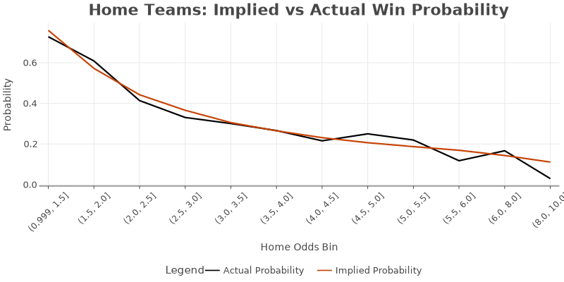
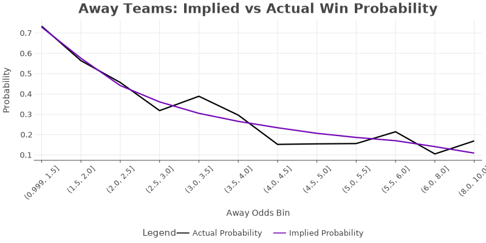
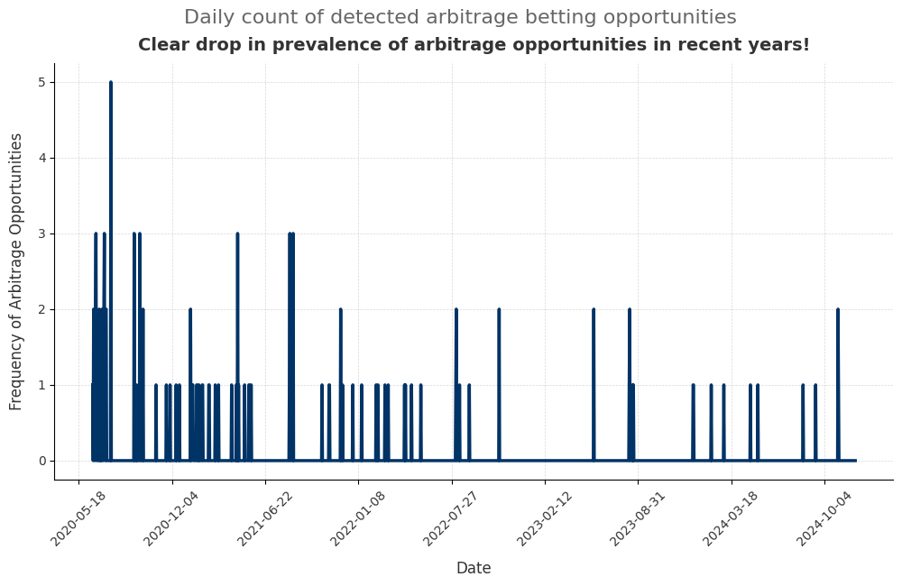
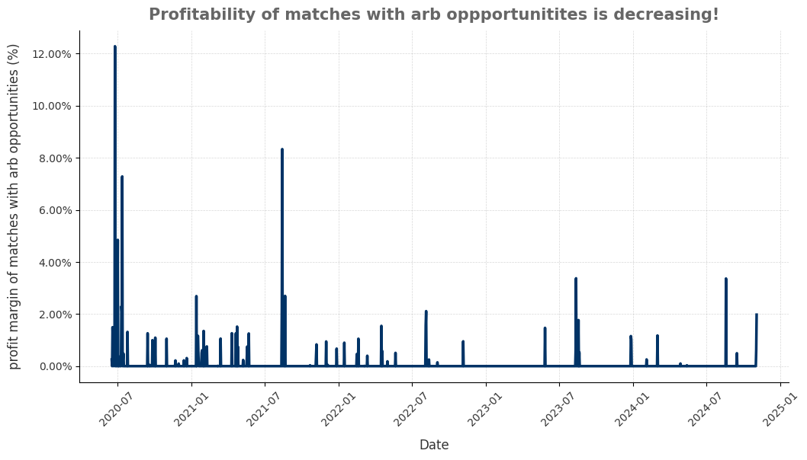
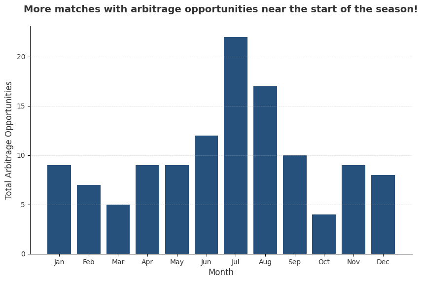
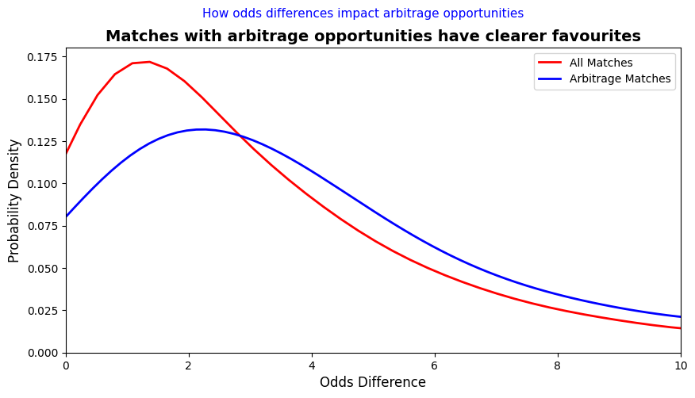

<link rel="stylesheet" type="text/css" href="./assets/css/style.css">

    <a href="index.html">Home</a>
    <a href="about.html">About</a>
    <a href="eda.html">Exploratory Data Analysis</a>
    <a href="backtesting.html">Backtesting</a>

## Investigation of Odds Mispricings
In simple unidirectional betting, we are most often 'gambling' because odds are priced in a way where the bookmakers always have an edge over us (in a large sample, of course). Hence, to further refine our strategy, we want to investigate if there are any mispricings in odds that we can potentially exploit in our discretionary strategies.

Evidently, home odds are rather efficiently priced with some home ground advantage observed in teams that are slight favourites and significant underdogs. What about away games?

Away odds are priced almost perfectly for teams which are favourites and fair matches. However, significant deviations occur when the away teams are underdogs. How about draws then?

Draw odds are almost always overpriced and at rather significant levels, offering no opportunity to exploit these mispricing.

### Insight

From our analysis, there are 3 opportunities to exploit mispriced odds:
1. Betting on Home Favourites (Odds from 1.25 to 1.75)
2. Betting on Home Underdogs (Odds from 4.5 to 5.5)
3. Betting on Away Underdogs (Odds from 2.5 to 4.0)

These discretionary strategies will be analysed alongside our simple strategies in [Backtesting Results](backtesting.md).

## Frequency and Profitability of Arbitrage Opportunities

Evidently, we can see that the prevalence of arbitrage opportunities have decreased over time. Fret not though! Because the profit margins might just be higher, compensating for the reduced prevalence of arbitrage opportunities. Let's take a look at the profit margins below:

Unfortunately, we can observe that the profitability of arbitrage opportunities has also decreased over the years in our dataset. 

### Insight

We hypothesize that the initial increase in arbitrage opportunities is due to the 'change in control' in the Premier League where traditionally underdog teams started fairing better. This caused the bookmakers to be unable to efficiently price the odds across the board as there was more uncertainty given this shakeup, but as time went by the bookmakers gathered more information and odds deviations reduced.

However, this doesn't mean that arbitrage loses its place as a strategy! As a full-proof strategy with no risk, we can technically make as much as we're willing to put in -- so even one arbitrage opportunity could make you thousands if the margin and bet size is large enough.

## Seasonality of Arbitrage Opportunities

### Insight

Interestingly, we can observe that there is some seasonality in the prevalence of arbitrage opportunities. At the start of the season (June/July) arbitrage opportunities are most prevalent as bookmakers are still divided on their expectations for different teams in the new season. Perhaps we could reduce the prevalence of our summer travels and commit more to arbitrage betting in the summer months? 

## Nature of Games With Arbitrage Opportunities

The odds difference was calculated by taking the absolute value of (home odds - away odds). It's a measure of the closeness of a match, a higher odds difference suggests there is a clear favourite and underdog from the bookies.

### Insight

A clear observation here is that the peak for matches with arbitrage opportunities is further to the right, This suggests games with arbitrage opportunities are less close and have a clearer favourite and underdog. Moreover, the blue line has a lower peak suggesting games with arbitrage opportunities are present across a wider range of odds differences.

## Conclusion

In our EDA, we have identified:

1. Potential Opportunities to Exploit Mispriced Odds in Simple Betting Strategies
2. The Nature of Matchups in Games with Arbitrage Opportunities

How then can we incorporate these ideas into our backtesting? Visit [Backtesting Results](backtesting.md) to find out more!
