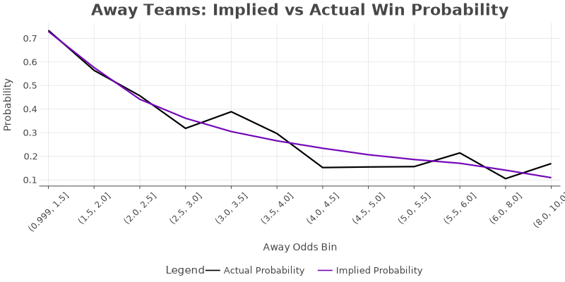
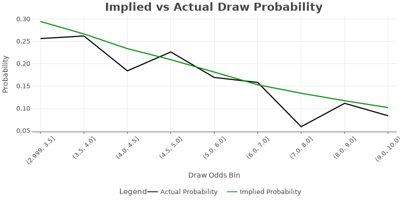
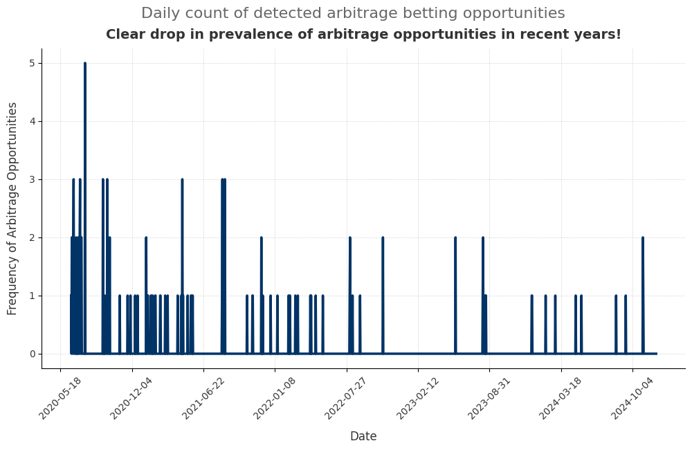

<link rel="stylesheet" type="text/css" href="./assets/css/style.css">

    <a href="index.html">Home</a>
    <a href="about.html">About</a>
    <a href="eda.html">Exploratory Data Analysis</a>
    <a href="backtesting.html">Backtesting</a>

# Exploratory Data Analysis

## Investigation of Odds Mispricings
In simple unidirectional betting, we are most often 'gambling' because odds are priced in a way where the bookmakers always have an edge over us (in a large sample, of course). Hence, to further refine our strategy, we want to investigate if there are any mispricings in odds that we can potentially exploit in our discretionary strategies.

## Frequency and Profitability of Arbitrage Opportunities

## Seasonality of Arbitrage Opportunities

