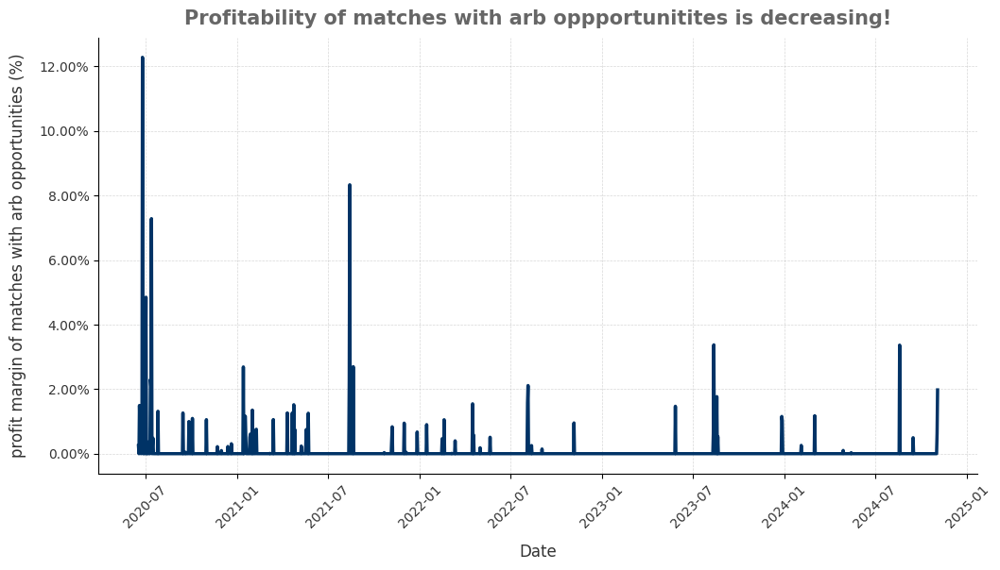
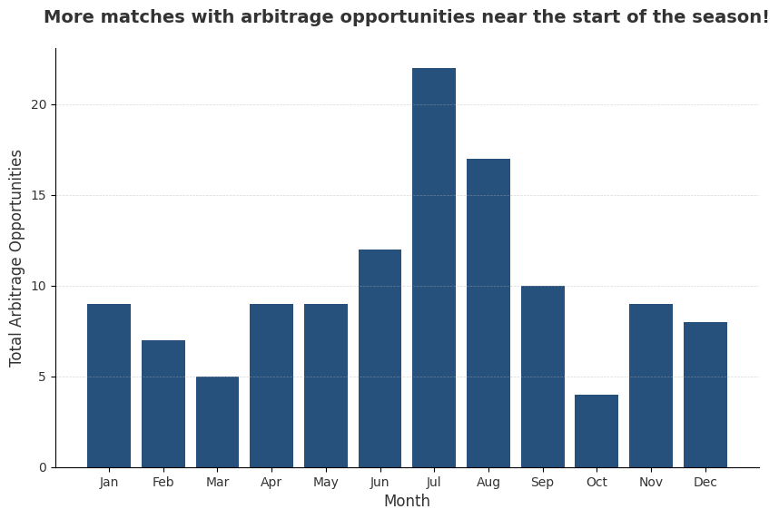

<link rel="stylesheet" type="text/css" href="./assets/css/style.css">

    <a href="index.html">Home</a>
    <a href="about.html">About</a>
    <a href="eda.html">Exploratory Data Analysis</a>
    <a href="backtesting.html">Backtesting</a>

# Exploratory Data Analysis

# Investigation of Odds Mispricings
In simple unidirectional betting, we are most often 'gambling' because odds are priced in a way where the bookmakers always have an edge over us (in a large sample, of course). Hence, to further refine our strategy, we want to investigate if there are any mispricings in odds that we can potentially exploit in our discretionary strategies.

Evidently, home odds are rather efficiently priced with some home ground advantage observed in teams that are slight favourites and significant underdogs.

Away odds are priced almost perfectly for teams which are favourites and fair matches. However, significant deviations occur when the away teams are underdogs.

Draw odds are almost always overpriced and at rather significant levels, offering no opportunity to exploit these mispricing.

## Insight

From our analysis, there are 3 opportunities to exploit mispriced odds:
1. Betting on Home Favourites (Odds from 1.25 to 1.75)
2. Betting on Home Underdogs (Odds from 4.5 to 5.5)
3. Betting on Away Underdogs (Odds from 2.5 to 4.0)

These discretionary strategies will be analysed alongside our simple strategies in [Backtesting Results](backtesting.md).

# Frequency and Profitability of Arbitrage Opportunities

## Seasonality of Arbitrage Opportunities

