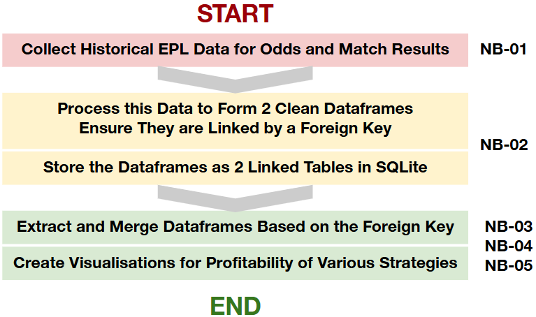

[](https://classroom.github.com/a/_SwzfpU1)

# Wanna Outsmart the Bookies This EPL Season? Aight, Bet!

##### **Authors:** Matthew Thoomkuzhy, Xinyan Liao and Noah Salehi
##### **Research Question:** What is the Best Betting Strategy for English Premier League games?
---

*Source: OpenAI*

## Project Overview

**We want to figure out what the best betting strategy is for premier league games.**

To do this we want to create a function which backtests different betting strategies on a Sample of historic premier league games. It will have a range of parameters e.g. stake limits, strategy type, start and end dates. 

We will then be using this function to backtest different strategies and track the returns of 100 virtual pounds 


**In order to do this, we need to collect 2 pieces of data:** 

1. Historical odds data for premier league games for the past 5 seasons, we will be collecting this using ['the odds API'](https://the-odds-api.com/)
2. Fixture outcomes for all premier league games for the past 5 seasons, this can be found at  ['Premier League Matches'](https://www.football-data.co.uk/englandm.php)

### Project Plan

---

### Repository Structure
```bash
.
├─ README.md
├─ .gitignore
├─ code
│  ├─ NB-01: Data Collection.ipynb
│  ├─ NB-02: Data Processing.ipynb
│  ├─ NB-03: Visualisation of Simple Betting Strategies.ipynb
│  ├─ NB-04: Visualisation of Arbitrage Betting Strategies.ipynb
│  ├─ NB-05: Visualisation of Positive EV Betting Strategy.ipynb
│  ├─ auth.py
│  └─ functions.py
└─ data
   ├─ epl.db
   ├─ raw
   │  ├─ historical_odds_data.json
   │  └─ historical_match_data.csv
   └─ visualisations
      ├─ plot1.png
      └─ plot2.png
```

## Technical Implementation

### Research Goals
The purpose of this project is to investigate different betting strategies, in order of increasing complexity:
- Betting on Win/Lose/Draws
  - Betting on the Favourite (Lower Odds)
  - Betting on the Underdog (Higher Odds)
  - Betting on the Draw
- Arbitrage
- Biased Arbitrage
- Positive Expected Value (EV) Betting

### Target Visualisations
- Line Charts
- Heatmaps

### Mock Data

Historical Odds Data
| sport | event_id        | event_name               | bookie_team1 | bookie_team2 | bookie_draw | odds_team1 | odds_team2 | odds_draw | arbitrage_profit_margin | commence_time               |
|-------|-----------------|--------------------------|--------------|--------------|-------------|------------|------------|-----------|-------------------------|-----------------------------|
| soccer_spl    | 1b4b38cffca35329314cee0e01c22f26      | St Mirren vs Motherwell | Coral | Betfair        | Betfair      |   2.00   | 4.70        |  3.55        | 0.554390      | 2024-12-07 15:00:00+00:00               | 2024-12-07 15:00:00+00:00 |

Historical Match Data
| Div | Date       | Time  | HomeTeam   | AwayTeam | FTHG | FTAG | FTR |
|-----|------------|-------|------------|----------|------|------|-----|
| E0  | 16/08/2024 | 20:00 | Man United | Fulham   | 1    | 0    | H   |

Here we can see that `FTR` stands for the full-time result, and *H* means that the home team had won.

### Data Aggregation
In line with the course's coding philosophy, we have decided to create our very own `fixture_id` to serve as the `FOREIGN KEY` so that the historical odds and results can be merged efficiently. 

The format will be as such:
`XXXYYYddmmyy`, where `XXX` and `YYY` are the 3-letter abbreviations of the home and away teams respectively. `ddmmyy` is the date of the match itself. This ensures that each match has a unique `fixture_id` and the data can be merged accurately.

For instance, a match between Manchester United (Home) and Manchester City (Away) on 13 December 2024 will be `MUNMCI131224`.

To achieve this, we will first create a dictionary containing all the abbreviations of the EPL teams and map the respective `Home_Team` and `Away_Team` columns to them.
```bash
team_abbr = {
    "Manchester United": "MUN",
    "Manchester City": "MCI",
    # ... and so on for all EPL teams
}

df['home_abbr'] = df['Home_Team'].map(team_abbr)
df['away_abbr'] = df['Away_Team'].map(team_abbr)
```

Then, we will format the date of the match into the desired format:
```bash
df['Date'] = pd.to_datetime(df['Date'])  
df['DDMMYY'] = df['Date'].dt.strftime('%d%m%y')
```

Lastly, we concatenate all the strings to form a unique `fixture_id`:
```bash
df['fixture_id'] = df['home_abbr'] + df['away_abbr'] + df['DDMMYY']
```

### Data Storage
These two Dataframes will be stored as tables in our SQLite database. 

The `PRIMARY KEY` will be the `event_id` assigned to every EPL match we have collected from the Odds API.

The `FOREIGN KEY` will be our own `fixture_id` that we have constructed above.

### Data Visualisation
These data will be read back into the subsequent notebooks and merged based on the `FOREIGN KEY`. Each notebook (NB-03, NB-04, NB-05) focuses on analysing different betting strategies, and will start with a fresh merged Dataframe to avoid inconsistencies.

## Work Distribution

NB-01: Data Collection (All Members)

NB-02: Data Processing (All Members)

NB-03: Analysis of Simple Win/Lose/Draw Strategies (Xinyan)

NB-04: Analysis of Arbitrage and Biased Arbitrage Strategies (Matthew)

NB-05: Analysis of Positive Expected Value Strategy (Noah)

## Risks, Mitigants and Backup Plans

### Risks:

1. **API Data Limitations**: The Odds API or Premier League data source may have rate limits, missing data, or restricted access, which could prevent complete data collection.
2. **Merging Dataset Error**: Issues with our custom `fixture_id` system may lead to incorrect merging of odds and match outcomes, skewing the analysis results.
3. **Strategy Biases**: Betting strategies may perform well on historical data but fail to generalize due to market inefficiencies or changes in team dynamics.

### Mitigants:

1. We will test the APIs early to understand their limitations and, if necessary, pre-download data to mitigate rate limits or access restrictions.
2. Our custom `fixture_id` will undergo rigorous testing with sample datasets to ensure accuracy before full-scale implementation.
3. We will evaluate strategies under realistic assumptions, such as fluctuating odds, betting limits, and varying market conditions, to reduce reliance on idealized results.

### Backup Plans:
If access to the APIs fails, we will source alternative datasets, such as publicly available odds and results archives. For merging issues, we will manually validate a subset of the data to ensure the system works before scaling. If time becomes a constraint, we will prioritize simpler strategies like betting on favorites or underdogs to deliver meaningful insights within the timeline.
