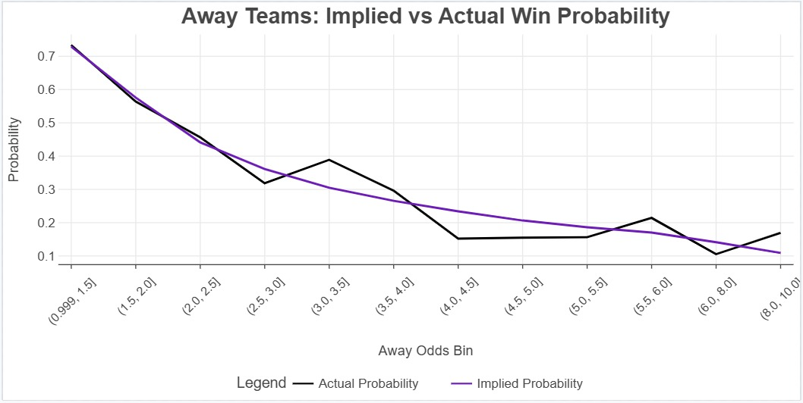
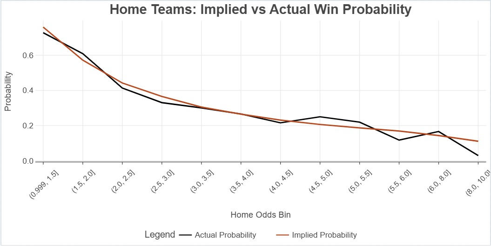
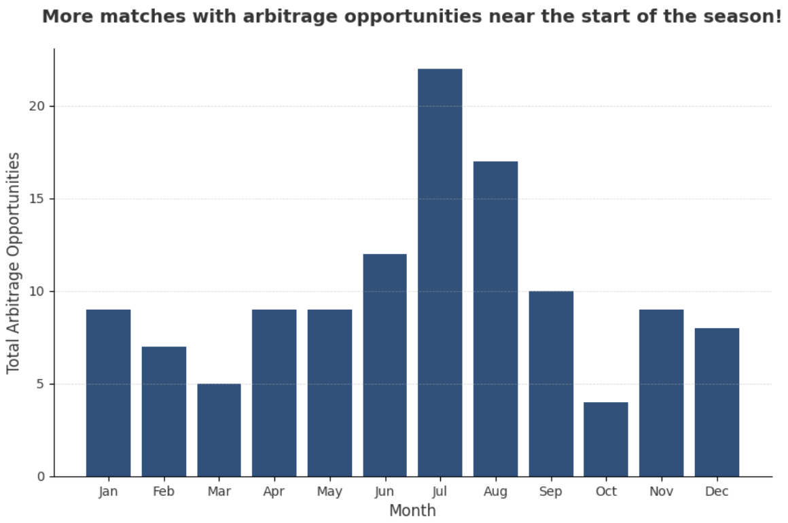

# Wanna Outsmart the Bookies This EPL Season? Aight, Bet!

##### **Authors:** Matthew Thoomkuzhy, Xinyan Liao and Noah Salehi
##### **Research Question:** What is the Best Betting Strategy for English Premier League games?
---

*Source: OpenAI*

## Project Overview 🗂

**We want to figure out what the best betting strategy is for premier league games.**

To do this we want to create a function which backtests different betting strategies on a Sample of historic premier league games. It will have a range of parameters e.g. stake limits, strategy type, start and end dates. 

We will then be using this function to backtest different strategies and track the returns of £100. 

---

## Results & Key Findings  

### Away Odds Pricings 
- **Away odds are priced efficiently for favorites and fair matches**.  
- **Significant deviations** occur when away teams are **underdogs**:  
  - **Slight Underdogs (30-40% win probability):** Actual win probability is **10% higher**.  
  - **Significant Underdogs (<20% win probability):** Actual win probability is **10% lower**.  

### Home Odds Pricing  
- **Home odds are mostly efficiently priced** but show some **home ground advantage**:  
  - **Slight Favourites (~57% win probability):** Actual win probability is **61%**.  
  - **Significant Underdogs (~20% win probability):** Actual win probability is **3-4% higher**.  

### Arbitrage Opportunities  
- **Arbitrage opportunities are more prevalent at the start of seasons** but have been declining over time.  
- **Arb events tend to have a higher odds difference**, often making a **clear winner more apparent**.  
- **Arb events occur more frequently** when:  
  - There is a **weak favorite**.  
  - There is a **strong underdog**.  

---

## Backtesting Results  

- **Only betting on away underdogs** is **profitable in the long run** (see visualization).  
- **All other strategies** eventually lead to **bankroll depletion**.  

- **Second-favorite biased arbitrage** yielded the **highest returns** among arbitrage strategies.  

---